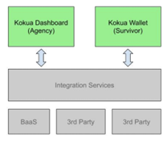

# Frontend Solution
## 1. Scope
Mobile and Web applications for Kokua product. Designs delivered by AID:TECH, backend in progress (out of this project scope). Teams agreed to separate delivery for phase 1 – MVP (expected till end of October) and phase 2 – full scope.

## 2. Team
### Kokua Dashboard
* React developer – Vladyslav Ovinnikov (vladyslav.ovinnikov@intive.com)
* React developer – Vsevolod Brovarnyi (vsevolod.brovarnyi@intive.com)
* Tester – Alin Cipariu (alin.cipariu.ext@intive.com)
### Kokua Wallet
* React Native developer – Andrei Ionescu (andrei.ionescu.ext@intive.com)
* React Native developer - Serhii Kulakov (serhii.kulakov@intive.com)
* Tester – Alin Cipariu (alin.cipariu.ext@intive.com)

## 3. Designs
Delivered by AID:tech, for estimation purposes team used - [Figma](https://www.figma.com/file/8fBuwFBvr6sWBY152iGZRN/Estimation-Kokua-File?node-id=0%3A1), for initial start of work team used - [Kokua design not updated! – Figma](https://www.figma.com/file/jOMYbQM0MDsmnmtfY1wvPw/Kokua-design-not-updated!?node-id=0%3A1).  To confirm scope of MVP, AID:Tech will create separate figma doc with MVP use cases, agreed delivery date 27.09. Postponed to 30.09. As for 29.09 team works based on [Kokua MVP for Devs](https://www.figma.com/file/mWHiMWwQMB7CuAdfMhRqOu/Kokua-MVP-for-Devs-(DRAFT!)?node-id=0%3A1).
## 4. Backend
Services will be provided and maintained by AID:tech. A GraphQL Schema will be provided to the development team. Until a deployment of services is available for the development team, frontend solution will use mocked data or temporary setups. Both clients will use the same backend deployment. Authentication is JWT based, authorization and security of services will be handled by AID:tech.
## 5. Frontend
### Technology stack for Wallet:
* React Native
* TypeScript
* Apollo - API is based on GraphQL, so Apollo client was added to facilitate server communication.
* Paper UI - Material Design compliant UI Framework, chosen to help with development of complex components. It was picked for this project because an official React Native implementation of Material UI is not available, and the community alternatives lack proper support.
* Jest - Unit testing framework
* Appium - Automated E2E testing tool
* Storybook - Will host a demo playground for all components created for this application. Story creation methodology will follow Atomic Design
* Sentry - used for error tracking, crash reporting. Needs configuration.
* Babel - Code compiler, expanding compatibility with latest JS versions
* Metro - JS bundler for React Native
* ESLint / Prettier - code formatting/linting tools

### Technology stack for Dashboard:
* React (Create React app),
* TypeScript
* Apollo - API is based on GraphQL, so Apollo client was added to facilitate server communication.
* Testing Library (Jest) - simple and complete testing utilities. Storybook - Will host a demo playground for all components created for this application. Story creation methodology will follow Atomic Design.
* Material UI - UI tools ready to use with global theming for all components.
* MSW - mock by intercepting requests on the network level. Seamlessly reuse the same mock definition for testing, development, and debugging.
* ESLint / Prettier - code formatting/linting tools
* Husky - pre-commit git hooks. You can use it to lint your commit messages, run tests, lint code, etc... when you commit or push. Husky supports all Git hooks.

### Gitflow 
Initial PoC to be pushed to Main branch. A develop branch to be created starting from Main, with feature/bugfix branching from it. Merges to develop to be made only with Pull request after both automated tests and code review approval. Merging to Main branch to happen for Releases, such to always consider Main branch as stable code, develop to be experimental/testing branch, and features/bugfix branches to be considered as work in progress. 

Git naming convention:

### CI/CD
* Wallet - TBC
* Dashboard - TBC
### Documentation
Description of solution will be provided by developer in the projects’ repositories as .md files, via code comments (JavaDoc style), and through thorough type declaration in TypeScript files. Developers will pick good naming conventions so code will be clear and intelligible. Storybook will be used for UI elements documentation.  