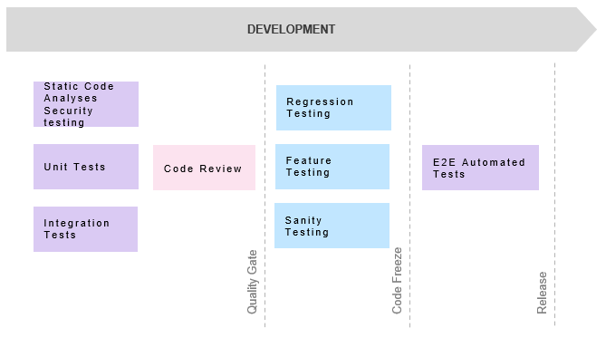

# TEST PLAN 
## 1. Introduction
### Testing goals
The main goal of testing is to find bugs as early as possible and fix bugs and make sure that the software is bug-free. For this project following goals have been set:
* **Immediate Goals**: the working application (“bug free”) with limited functionalities that can be used by limited victims of the disasters
* **Long-term Goals**: the working application with full functionality; regression and sanity testing done both manual (some selected scenarios) and automated
* **Post-Implementation Goals**: fully automated test process with no need for manual regression or sanity testing

### Scope
The scope of a test defines what areas of a customer's product are supposed to get tested, what functionalities to focus on, what bug types of the customer are interested in, and what areas or features should not be tested by any means. If something is in scope, please test it; if something is out of scope, it should not be tested.

**The scope for this project is defined in the following way**:
* Mobile Application manual/automated testing in separation (no backend)
* Mobile Application manual/automated testing with a working backend
* Mobile Application Automates Unit Tests/Integration tests with 70% code coverage
* Mobile Application Automated end-2-end
* Web Application manual/automated testing in separation (no backend)
* Web Application manual/automated testing with a working backend
* Web Application Automates Unit Tests/Integration tests with 70% code coverage
* Web Application Automated end-2-end

### Team setup (roles)
* Mobile App Developer – responsible for unit testing and integration testing for Mobile App
* Web App Developer – responsible for unit testing and integration testing for Web App
* Manual Tester – responsible for test documentation and manual testing (E2E, Regression and Sanity)  
* Automated Tester – responsible for test documentation and manual testing (E2E, Regression and Sanity)

## 2. Testing Methodology
### Static code analysis
Static analysis runs checks on source code before it is compiled or executed. It doesn’t check if code does what it’s intended to do—that’s what unit testing and integration testing are for. But static analysis can perform many useful checks on code without a need to run it. It will eliminate simple but easily made errors and enforce coding standards and styles across teams. It will be also used to detect security vulnerabilities in code base.

### Unit testing
Unit testing serves as the foundation of the test pyramid. Unit tests have a limited scope and ensure that isolated code units function as expected. Unit tests should assess a single variable and not rely on external dependencies. The team must execute pre- and post-commit tests in this pyramid layer, and tests happen to be dev-triggered.

### Integration testing
Integration tests checks how a code interacts with external components. These components may include external services(APIs), databases, web services, and similar elements. Integration tests ensure that the software communicates efficiently and retrieves accurate data to perform as expected.

### E2E testing
* **End-to-end Testing** checks the enormous bulk of code (the entire application). It uses a test environment and data to simulate real-world functionality. End-to-end testing necessitates that real devices more closely resemble the application on an end user's smartphone, as real users report issues on real devices and not virtual ones. Testers will consider facts like different ways an end-user might engage with the app, what they would do to achieve their objectives with the app, and what might go wrong. The aim is to develop a test based on such actions.
* **Sanity Testing** performed after receiving a software build, with minor changes in code, or functionality, to ascertain that the bugs have been fixed and no further issues are introduced due to these changes. The goal is to determine that the proposed functionality works roughly as expected. If the sanity test fails, the build is rejected to save the time and costs involved in more rigorous testing.
* **Regression Testing** is defined as a type of software testing to confirm that a recent program or code change has not adversely affected existing features. Regression Testing is nothing but a full or partial selection of already executed test cases which are re-executed to ensure existing functionalities work fine. This testing is done to make sure that new code changes should not have side effects on the existing functionalities. It ensures that the old code still works once the latest code changes are done.

## 3. Test deliverables
### GitHub/Linear
To use Linear as a management tool to set the sprints, estimations, create tickets, bugs, statistics etc, TBC

### Reports
Test Report  For the Kokua mobile/dashoard – TBC

## 4. Test Flow

## 5. Risks and assumptions
### Test Architecture Concerns
TBD/TBC

## 6. Resource and Environment
### Test Devices/OS
A key part of having a robust testing process is the devices on which the test is being run. Edge >= 91; Firefox >= 78; Chrome >= 90; Safari (macOS) >= 14; Safari (iOS) >= 12.5. Physical devices Android – Samsung, IOS – Iphone 10 or higher

### Tools
* Mobile Automation Framework: **Appium** (2.0 TBC)
* Web UI Automation Framework: **Selenium WebDriver** (4.0 TBC)
* Mobile and Web Unit Tests Framework – **Jest** (26.6.3 and above)

### Bug template
* **Summary**: name of the issue that will be short and descriptive
* **Description**: if the summary is not sufficient, explain the bug in a few words. Share it in easy-to-understand language.
* **Environment**:
  * for Web App provide information about: the test environment, operating system, browser,  zoom level and screen size
  * for Mobile App provide information about: the test environment, and device manufacture, model, operating system and any additional information about the device which might be relevant (like rooted device).
* **Console logs**: if available and relevant provide console logs
* **Source URL**: if available and relevant provide source URL
* **Visual proof**: A picture is worth a thousand words. Although it might not be enough, a visual element like a screenshot or a video will help your developers understand the problem better and faster.
* **Steps to reproduce**: A screenshot is a proof that you had a problem, but keep in mind that your developer might not be able to reproduce the bug. Make sure to describe, with as much detail as possible, the steps you took before you encountered the bug.
* **Expected results**: Explain what the results are you expected - be as specific as possible.
* **Actual results**: Explain what the actual results are, pin point where it differs from expected.

### Design patterns
* POM (Page Object Model) is a design pattern, popularly used in test automation that creates an Object Repository for web UI elements. The advantage of the model is that it reduces code duplication and improves test maintenance.
* Under this model, for each web page in the application, there should be a corresponding Page Class. This Page class will identify the WebElements of that web page and also contains Page methods which perform operations on those WebElements. The name of these methods should be given as per the task they are performing, i.e., if a loader is waiting for the payment gateway to appear, POM method name can be waitForPaymentScreenDisplay().
* Locating elements via selectors
* A locator enables testers to select an element to act on it.
  * Examples of selectors: ID, CSS Selectors, xPath etc.

### Cucumber
* Cucumber is a testing tool that supports Behavior Driven Development (BDD). It offers a way to write tests that anybody can understand, regardless of their technical knowledge. In BDD, users (business analysts, and product owners) first write scenarios or acceptance tests that describe the behavior of the system from the customer’s perspective, for review and sign-off by the product owners before developers write their codes.
* Cucumber Given – When - Then statements
  * Feature: The file should have extension .feature and each feature file should have only one feature. The feature keyword being with the Feature: and after that add, a space and name of the feature will be written.
  * Scenario: Each feature file may have multiple scenarios, and each scenario starts with Scenario: followed by scenario name.
  * Background: Background keyword helps you to add some context to the scenario. It can contain some steps of the scenario, but the only difference is that it should be run before each scenario.
  * Given: The use of Given keyword is to put the system in a familiar state before the user starts interacting with the system. However, you can omit writing user interactions in Given steps if Given in the “Precondition” step.
  * When: When the step is to define action performed by the user.
  * Then: The use of ‘then’ keyword is to see the outcome after the action in when step.
  
### Test environments
* Web testing environments (TBC)
* Mobile testing environments (TBC)    
